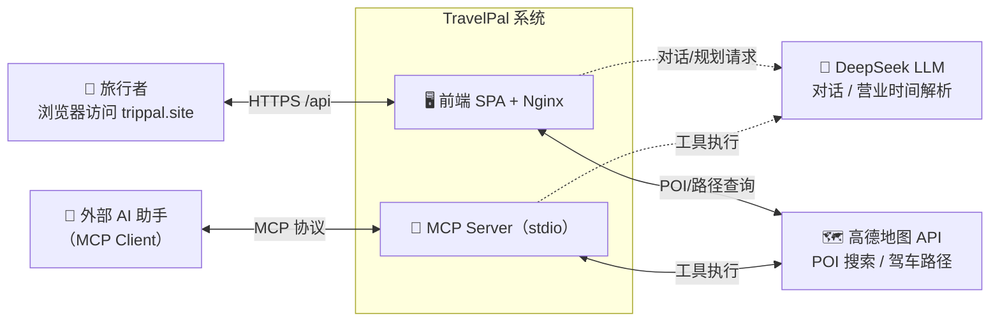
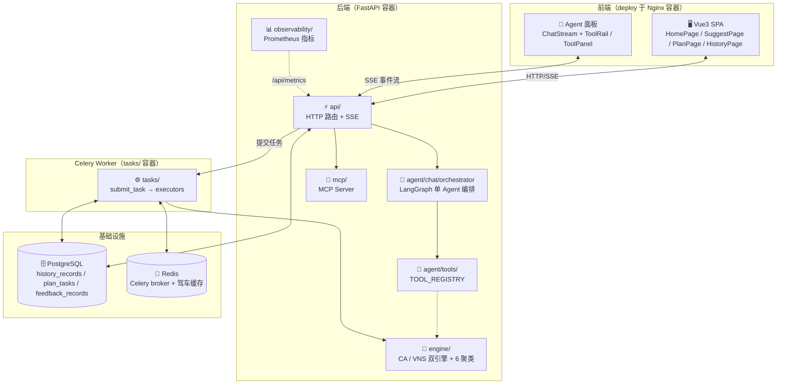

# TravelPal 架构总览

系统总入口文档：C4 架构图（Context / Container），先看这里建立整体认知。

## 修改记录

| 日期 | 变更 | 动机 |
|------|------|------|
| 2026-08-06 | 初始创建 | 补充项目总入口，内嵌 C4 Context/Container 图，串联 ADR 决策速览与文档导航 |
| 2026-08-11 | 精简为纯 C4 图 | 架构图是「被引对象」：删除系统定位/决策速览/文档导航等文字，避免与 docs 各包重复维护；文档导航职责移交 docs/index.rst |

## 一、C4 Context 图（系统与外部交互）

## 二、C4 Container 图（系统内部组件）

