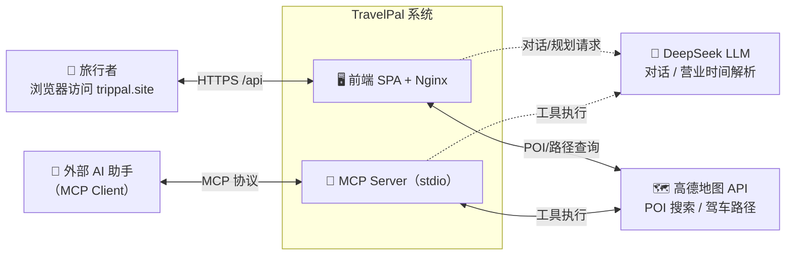
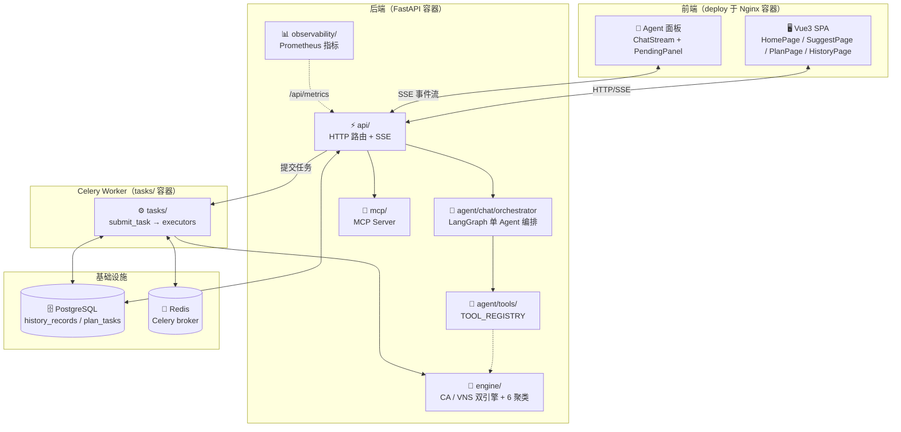

# TravelPal 架构总览

系统总入口文档：先看这里建立整体认知，再按需下钻各层细节。

## 修改记录

| 日期 | 变更 | 动机 |
|------|------|------|
| 2026-08-06 | 初始创建 | 补充项目总入口，内嵌 C4 Context/Container 图，串联 ADR 决策速览与文档导航 |

## 一、系统定位

TravelPal 是一个面向个人的智能旅行规划系统：用户用自然语言描述偏好（城市、想去的地方、预算），
系统通过 **LLM Agent 对话共创** + **CA/VNS 双引擎求解**，产出一份**可执行的行程方案**
（含每日路线、时间窗约束下的最优路径、真实驾车轨迹地图）。

不是「生成文字攻略」的工具，而是「生成可执行行程方案」的伴侣型产品
（项目哲学见 [ADR-004](./docs/ADR/004.md)）。

## 二、C4 Context 图（系统与外部交互）

角色说明：

| 外部实体 | 交互方式 | 说明 |
|---------|---------|------|
| 旅行者 | 浏览器（HTTPS） | 前端 SPA，经 Nginx 反代访问后端 /api |
| 外部 AI 助手 | MCP 协议（stdio） | 通过 MCP Server 调用叶子工具（poi_lookup / get_plan 等），见 [tools.md](./docs/structure/tools.md) |
| 高德地图 API | 服务端 HTTP | POI 坐标/营业时间查询、两点驾车路径规划 |
| DeepSeek LLM | 服务端 HTTP | 对话生成、营业时间 opentime2 解析（[ADR-005](./docs/ADR/005.md)） |

## 三、C4 Container 图（系统内部组件）

分层一句话（细节见 [structure/backend.md](./docs/structure/backend.md)）：

| 层 | 职责 | 关键资产 |
|----|------|---------|
| `api/` | HTTP 边界 | routes / schemas / server（CORS、/api/metrics） |
| `agent/` | 对话编排与工具 | orchestrator（LangGraph）、tools（TOOL_REGISTRY）、prompts |
| `engine/` | 核心求解 | ca.py / vns.py / clustering.py / search.py / pipeline.py |
| `tasks/` | 异步任务 | Celery app / executors / 任务状态流转 |
| `domain/` + `infrastructure/` | 防腐层 | LLMService / WeatherService / retrieval 占位（[ADR-008](./docs/ADR/008.md)） |
| `data/` | 数据接入 | amap_loader / model（ORM + Alembic） |
| `mcp/` | 外部 AI 旁路 | 遍历 TOOL_REGISTRY 动态注册 |

## 四、关键决策速览

定义系统形态的核心决策（一句话版），完整索引见 [ADR/README.md](./docs/ADR/README.md)：

| ADR | 决策 | 一句话 |
|-----|------|--------|
| [001](./docs/ADR/001.md) | 双引擎架构 | CA（秒级）/ VNS（分钟级）平级并行，废弃 SA+VNS 串行流水线 |
| [002](./docs/ADR/002.md) | 前端选型 | Vue3 + Vite + Composition API，废弃 Streamlit |
| [003](./docs/ADR/003.md) | 可视化 | 高德 AMap 2D 统一 GCJ-02，废弃 Cesium 3D |
| [004](./docs/ADR/004.md) | 项目哲学 | 「旅行伴侣」而非「规划工具」——把决策乐趣留给人 |
| [008](./docs/ADR/008.md) | 架构演进路线图 | 防腐层 / MCP / Celery / 观测性等七轴落地顺序 |
| [012](./docs/ADR/012.md) | LangChain 克制 | 能自写不引框架，编排必须用 LangGraph，重生态只留占位 |

## 五、文档导航

| 目的 | 文档 |
|------|------|
| 项目结构（全局/后端/前端/Agent/数据字典/工具清单） | `structure/`（7 篇，下无索引按此表） |
| ADR 写作规范 + 12 篇完整索引 | `ADR/README.md` |
| 编码规范（P0-P3 注释体系） | `runbooks/coding.md` |
| 部署指引 | `runbooks/deploy.md` |
| Git 分支/提交规范 | `runbooks/git.md` |
| 产品路线图 | `产品路线图.md` |
| 产品标语与哲学展开 | `slogan.md` |
| 故障排查手册 | `runbooks/troubleshooting.md` |
| OpenAPI 规范 | `openapi.json`（Sphinx 构建自动生成） |
