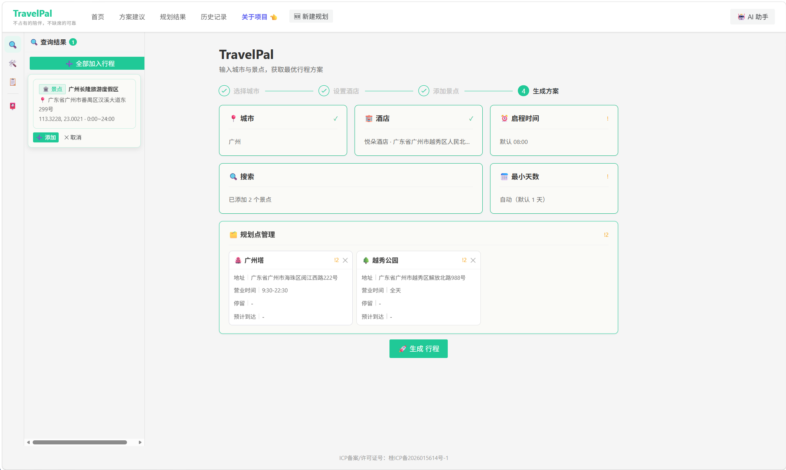

# TravelPal

**不占有的陪伴，不缺席的可靠。**

> 基于约束求解的可执行旅行规划工具——你提需求，它算行程。

[](https://trippal.site)
[](https://github.com/xiaojiune/TravelPal/releases)
[](LICENSE)



📌 **入口**
- 📖 文档站：<https://xiaojiune.github.io/TravelPal/>
- 🏗️ 架构总览：[ARCHITECTURE.md](ARCHITECTURE.md)（C4 图）
- 📦 版本记录：[Releases](https://github.com/xiaojiune/TravelPal/releases)（tag 驱动自动生成）

📌 **版本状态**：🟠 新功能预发布 · 🔵 稳定版已部署（[dev 预览](https://github.com/xiaojiune/TravelPal/tree/dev) · [在线体验](https://trippal.site)）

🏷️ `AI 行程决策引擎 · AI 辅助规划 · 全栈工程化`

---

## 🎒 规划一次旅行，是不是总这样？

- 翻遍攻略和点评，还是不知道该把哪些地方排进同一天
- 营业时间、开车耗时、停留时长……全靠感觉估算
- 排出来的行程"看起来合理"，真出门却发现根本走不完

TravelPal 把这些体力活接过来：填好城市、酒店和想去的景点，它把坐标、营业时间、驾车耗时全部核实好，再交给算法排出一条真的能走完的行程。

因为大多数工具只帮你「想」，不帮你「算」——TravelPal 用算法把行程「算」出来。

## ✨ 它给你什么

- **一次填写，一条真行程**：选好城市、酒店和景点，坐标、时间窗、驾车耗时全部自动核实
- **精确到分钟的行程表**：每个景点几点到、几点走、营业时间对不对，一目了然
- **真实驾车路线**：不是画直线，基于高德真实路网逐段验证
- **多套方案挑着选**：不同天数与求解方法多组选择，决策权始终在你

## 🤔 和市面上的旅行产品有什么区别？

<details>
<summary>点击展开：三类产品对比</summary>

**基础设施与平台（高德地图、携程、飞猪）**
解决「怎么到、怎么订」：地图导航、交通住宿预订。优势是数据与生态完备，但不负责「该去哪、按什么顺序去」——排程决策仍靠你自己。

**商业与主流规划软件（马蜂窝、穷游、Stardrift、TripIt）**
攻略内容社区或手动整理工具。优势是 UGC 丰富、信息真实，但规划本质是信息聚合与人工整理，不对景点顺序、营业时间做约束求解——给你「建议」，不是「可执行的方案」。

**开源与 AI Agent 项目（智旅云图、TripStar）**
同走对话式 AI 路线，多为 LangChain + RAG 生成图文攻略。样式丰富、观感高级，但伴随着「不确定性」：绕路、营业时间不符、时间估算失真，方案看着合理，未必走得了。

</details>

**TravelPal 不只聚合信息，更给你可信任的行动**
- 别人有的，它也可以有：需求理解与信息聚合（POI 坐标、营业时间、驾车耗时），LLM 负责听懂与整理
- 别人没有的，它补上：CA/VNS 把营业时间、停留时长、驾车耗时纳入约束求解，每条路线经算法校验——给你「建议」之外的「可执行方案」
- 产出「精确时间表 + 真实驾车路线 + 可交互地图」

举个例子：把「故宫 + 天坛 + 景山」排进同一天，TravelPal 会逐一校验三段驾车耗时与闭馆时间，告诉你几点该到、几点必须走——而不是只给你一张看起来顺眼的清单。

## ⚙️ 技术概览

> 想快速了解它能做什么，看上面就够了；如果你好奇它是怎么做到的，下面再深入。

[](https://codecov.io/gh/xiaojiune/TravelPal)
[](backend/mcp/)
[](pyproject.toml)
[](frontend/)

**决策层 —— LLM Agent（LangGraph 编排）**
- 听懂自然语言，把「想去哪」变成可执行的规划请求
- 工具化接入 POI 查询、驾车耗时、基于表单直接生成行程

**求解层 —— CA / VNS 元启发式算法（未引入第三方求解框架）**
- 压缩退火（CA）为当前主力：秒级给出可行方案
- 变邻域搜索（VNS）面向单日大规模场景，为未来预留；二者同属未来统一 OR 求解器
- 严格约束营业时间窗、停留时长与驾车耗时，输出路径最优的每日行程
- 基于 Dumas TSPTW 基准算例验证求解质量，结果稳定可靠

**工程层 —— 全栈工程化落地**
- FastAPI + SSE 流式对话，Celery + Redis 异步任务，PostgreSQL + Alembic 数据迁移
- Vue 3 + TypeScript + Naive UI，高德地图真实路线可视化
- Docker Compose 一键部署，GitHub Actions 自动化 CI/CD
- 面向外部 AI 助手提供 MCP Server 接入同一套工具

技术栈速览：**FastAPI · LangGraph · Celery · PostgreSQL · Redis · NumPy · Numba · Vue 3 · TypeScript · Naive UI · Docker Compose · Nginx · GitHub Actions · MCP Server**

## 🚀 快速体验（推荐）

<details>
<summary>点击展开：一键 Docker 体验</summary>

前置条件：仅需 Docker、Docker Compose。

```bash
# 1. 克隆
git clone https://github.com/xiaojiune/TravelPal.git
cd TravelPal

# 2. 配置环境变量
cp .env.example .env
# 编辑 .env，填入以下 key（⚠️ 需先申请 API Key，见下表）

# 3. 一键启动（五服务编排：PostgreSQL + Redis + Celery worker + 后端 + 前端 Nginx）
make deploy-up
# 首次启动自动执行数据库迁移（Alembic），无需手动初始化

# 4. 打开 http://localhost
# 后端启动后可访问 http://localhost:8000/docs 查看交互式 Swagger API 文档
```

> ⚠️ **无 API Key 时**：Agent 对话依赖 LLM API（DeepSeek），POI 查询、驾车耗时与前端地图渲染依赖高德 API；未配置这些 Key，规划与对话功能将不可用。

### 获取 API Key

| Key | 获取地址 | 用途 |
|-----|---------|------|
| `AMAP_API_KEY` | [高德开放平台](https://lbs.amap.com/) → 控制台 → 应用管理 → 创建应用 → 添加 Key（Web 服务） | 后端 POI 搜索 / 驾车路径规划 |
| `AMAP_JS_KEY` | 高德控制台 → 同一应用下添加 Key（Web JS API） | 前端地图渲染 |
| `AMAP_JS_SECURITY_CODE` | 创建上述 Web(JS API) Key 后，在 Key 详情中查看安全密钥 | 前端地图安全验证 |
| `LLM_API_KEY` | [DeepSeek 平台](https://platform.deepseek.com/) → API Keys | Agent 对话 |

</details>

## 🔧 本地开发（贡献者）

<details>
<summary>点击展开：本地开发环境</summary>

前置条件：Python 3.12、Node.js 22、Docker（用于启动本地 PostgreSQL / Redis）。

本地数据库依赖通过 Docker 启动（无需本地安装）：

```bash
make dc-up
```

```bash
make install            # 一键安装前后端依赖
cp .env.example .env    # 配置环境变量
# 本地开发时，将 .env 中 DATABASE_URL 的 host 由 postgres 改为 localhost
make serve              # 启动后端（热重载）
make dev                # 启动前端（Vite HMR）
```

异步任务（行程规划）依赖 Celery worker，本地需另开终端启动：

```bash
make celery
```

完整命令清单：

```bash
make help
```

</details>

## 🗺️ Roadmap

| 阶段 | 方向 |
|------|------|
| v1.0-beta（📍 当前阶段） | 核心闭环上线、联调验收 |
| v1.0 | 正式发布：文档统一翻修、稳定上线 |
| v1.1 | 对话式行程调整、异步任务面板、Agent 驱动 UI（表单卡片）、方案对比视图 |
| 远期 | 个性化偏好记忆、多 Agent 编排、MCP 生态接入 |

## ❓ 常见问题

关于隐私、联系方式与产品定位的更多问答，见 [关于页面](https://trippal.site/about)（在线体验右上角「关于项目」）。

## 🤝 贡献

欢迎提交 [Issue](https://github.com/xiaojiune/TravelPal/issues)、[PR](https://github.com/xiaojiune/TravelPal/pulls) 与使用反馈。开发环境见上方「本地开发」，代码规范见 [docs/runbooks/coding.md](docs/runbooks/coding.md)。

## 许可

Copyright © 2026 xiaojiune. Released under the MIT License.

---

欢迎 Star / Issue / PR 交流。
